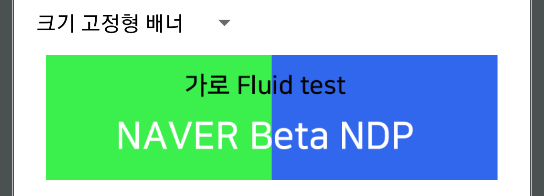
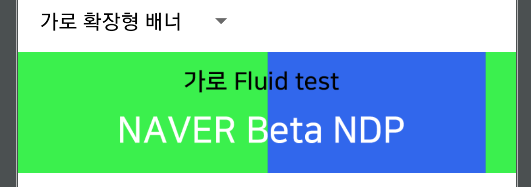

# 배너 광고
배너 광고는 앱에 레이아웃 내에 표시되는 직사각형 이미지 형태의 광고로서 `WebView` 로 구현된 광고형태입니다.


----

### [Step 1] Dependency 추가 및 초기화
[공통 통합 내용을 참고해 주세요](../README.md)

----

### [Step 2] 레이아웃에 Banner Ad 를 추가할 ViewGroup 을 추가

배너 광고를 게재하기 위해서는 먼저 광고를 게재하려는 `Activity` 또는 `Fragment` 의 레이아웃에 배너 광고가 삽입될 `ViewGroup` 을 추가해야 합니다.

아래 예제에서는 `RelativeLayout` ViewGroup 에 `banner_container` 라는 id 로 배너 광고가 게재될 을 선언했습니다.

```
<androidx.constraintlayout.widget.ConstraintLayout xmlns:android="http://schemas.android.com/apk/res/android"
    xmlns:app="http://schemas.android.com/apk/res-auto"
    xmlns:tools="http://schemas.android.com/tools"
    android:layout_width="match_parent"
    android:layout_height="match_parent"
    tools:context=".BannerFragment">

        <RelativeLayout
            android:id="@+id/banner_container"
            android:layout_width="wrap_content"
            android:layout_height="wrap_content"
            android:layout_centerHorizontal="true"
            android:layout_alignParentBottom="true"
            app:layout_constraintBottom_toBottomOf="parent"
            app:layout_constraintEnd_toEndOf="parent"
            app:layout_constraintStart_toStartOf="parent" />

</androidx.constraintlayout.widget.ConstraintLayout>
```

----

### [Step 3] AdParam 과 GfpBannerAdView 생성
위에서 선언한 ViewGroup 에 게재될 배너 광고에 대한 객체를 생성합니다.
먼저 광고 요청에 대한 AdParam 객체를 생성하고 `GfpBannerAdView` 의 생성자에 할당하게 됩니다.

```
@Override
public View onCreateView(@NonNull LayoutInflater inflater, ViewGroup container,
                         Bundle savedInstanceState) {
    View view = inflater.inflate(R.layout.fragment_banner, container, false);
    bannerAdContainer = view.findViewById(R.id.ad_container);

    //광고 요청 파라미터
    AdParam adParam = new AdParam.Builder()
                    .setAdUnitId("NS_AOS_MIX_BANNER_TEST")
                    .addUserParam("testKey", "tesValue")
                    .build();

    GfpBannerAdView bannerAdView = new GfpBannerAdView(this, adParam);
    bannerAdContainer.addView(bannerAdView);
    return view;
}
```

#### 3-1. 레이아웃 타입 설정
GfpBannerAdView 에서는 아래 4가지 레이아웃 타입을 제공하며 미설정시 기본값은 `크기 고정형 배너(FIXED)`로 설정됩니다.

- 크기 고정형 배너 (FIXED)
서비스에서 설정한 광고 컨테이너 크기에 관계없이 광고영역의 크기가 고정된 형태입니다.


- 가로 확장형 배너 (FLUID_WIDTH)
서비스에서 설정한 광고 컨테이너 크기에 맞게 광고영역의 가로 크기가 확장되는 형태입니다.<br>


- 세로 확장형 배너 (FLUID_HEIGHT)
서비스에서 설정한 광고 컨테이너 크기에 맞게 광고영역의 세로 크기가 확장되는 형태입니다.<br>

- 확장형 배너 (FLUID)
서비스에서 설정한 광고 컨테이너 크기에 맞게 광고영역의 가로, 세로 크기가 확장되는 형태입니다.<br>

> 단, 확장형 배너 타입을 설정하더라도 확장 기능을 지원하지 않는 고정형 광고 소재가 내려오는 경우 `크기 고정형 배너`와 동일하게 고정된 크기로 랜더링 됩니다.

#### 3-2. 매체 메타 정보 전달
- 매체와 광고간 약속된 key/value 값을 전달 합니다.

##### 3-3. 레이아웃 타입 설정 예시
```
GfpBannerAdOptions bannerAdOptions = new GfpBannerAdOptions.Builder()
                .setBannerViewLayoutType(BannerViewLayoutType.FLUID_WIDTH)
                .setHostParam(new HostParam.Builder()
                                    .addMetaParam("theme", "dark")
                                    .addMetaParam("fontColor", "#FFFFFF")
                                    .addMetaParam("fontSzie", "10")
                                    .build())
                .build();
bannerAdView.setBannerAdOptions(bannerAdOptions);
```

#### 3-5. 타임아웃 설정
- GfpBannerAdView 배너의 setTimeoutMillis 을 통해 광고 요청마다 별도의 타임아웃 설정이 가능합니다.
- 미설정시 기본값은 `GfpSdk.setSdkProperties()` 를 통해 전역 설정된 값(기본값 : 60초)을 따라갑니다.

```
...
bannerAdView.setTimeoutMillis(30_000L);
...
```

----

### [Step 4] 광고 이벤트 수신
배너 광고의 생명 주기(예: 로드, 클릭, 노출, 에러) 에 대한 이벤트는 `BannerAdListener` class 를 통해서 수신할 수 있습니다.\
광고 로드 이벤트(onAdLoaded) 수신 이후 `GfpBannerAdView 의 getAdSize()` 인터페이스를 통해 실제 로드된 배너 광고의 사이즈 조회가 가능합니다.<br>

```
        bannerAdView.setAdListener(new BannerAdListener() {
            @Override
            public void onAdLoaded(GfpBannerAd ad) {
                // 배너 광고 load 가 성공했을 때 실행됩니다.
            }

            @Override
            public void onAdLoaded(GfpBannerAd ad) {
                // 배너 광고만 사용한다면 해당 callback 은 호출되지 않습니다.              
            }

            @Override
            public void onAdClicked(GfpBannerAd ad) {
                // 배너 광고 click 이 발생했을 때 실행됩니다.
            }

            @Override
            public void onAdImpression(GfpBannerAd ad) {
                // 배너 광고의 노출이 발생했을 때 실행됩니다.
            }

            @Override
            public boolean handleClick(GfpBannerAd ad, String... urls) {
                // 배너 광고의 Click 처리를 override 설정했을 경우, 사용자가 클릭을 했을 때 실행됩니다.
            }

            @Override
            public void onAdMetaChanged(GfpBannerAd ad, Map<String, String> params) {
                // 배너 광고의 메타 정보 전달시 실행됩니다.
            }

            @Override
            public void onAdSizeChanged(GfpBannerAd ad) {
                // 배너 광고 웹뷰 사이즈 변경시 실행됩니다.
                // 'ad.getBannerAdSize()' 메서드를 통해 변경된 사이즈를 조회할 수 있습니다.
            }

            @Override
            public void onError(GfpBannerAd ad, GfpError error) {
                // 배너 광고 요청이 실패했을 때 실행됩니다.
            }
        });
```

> BannerAdListener 는 사용하고자 하는 callback method 만 override 해서 사용할 수 있습니다.

----

### [Step 5] 광고 로드 (샘플)
GfpBannerAdView 에 대한 설정이 마무리 되었다면 광고를 로드할 수 있습니다.

다음은 Activity 의 onCreate() method 에서 광고를 로드하는 방법을 보여주는 예시입니다.

```
package ...

import ...
package ...

import ...
import com.naver.gfpsdk.GfpBannerAdView;
import com.naver.gfpsdk.GfpAd;
import com.naver.gfpsdk.GfpBannerAdView;
import com.naver.gfpsdk.BannerAdListener;
import com.naver.gfpsdk.model.AdParam;
import com.naver.gfpsdk.model.GfpError;

public class MainActivity extends AppCompatActivity {
    private GfpBannerAdView bannerAdView;

    protected void onCreate(Bundle savedInstanceState) {
        super.onCreate(savedInstanceState);
        setContentView(R.layout.activity_main);

        RelativeLayout adContainer = findViewById(R.id.banner_container);

        //광고 요청 파라미터
        AdParam adParam = new AdParam.Builder()
                        .setAdUnitId("NS_AOS_MIX_BANNER_TEST")
                        .addUserParam("testKey", "tesValue")
                        .build();

        //BannerAdView 셋팅
        GfpBannerAdView bannerAdView = new GfpBannerAdView(this, adParam);
        adContainer.addView(bannerAdView);

        //BannerAdOption 설정
        GfpBannerAdOptions bannerAdOptions = new GfpBannerAdOptions.Builder()
                        .setBannerViewLayoutType(BannerViewLayoutType.FLUID_WIDTH)
                        .setHostParam(new HostParam.Builder()
                                            .addMetaParam("theme", "dark")
                                            .addMetaParam("fontColor", "#FFFFFF")
                                            .addMetaParam("fontSzie", "10")
                                            .build())
                        .build();
        bannerAdView.setBannerAdOptions(bannerAdOptions);

        //타임아웃 설정
        bannerAdView.setTimeoutMillis(30_000L);

        //광고 이벤트 리스너 설정
        bannerAdView.setAdListener(new BannerAdListener() {
                    @Override
                    public void onAdLoaded(GfpBannerAd ad) {
                        //ad.getBannerAdSize() 로 크기 확인.
                        //ad.getAdProviderName() 로 로드 된 광고 제공자 (ex. DFP) 확인
                        Log.d("MainActivity", "onAdLoaded");
                    }
                    ...
                    @Override
                    public void onError(GfpBannerAd ad, GfpError error) {
                        //ad.getResponseInfo() 로 로드 실패된 광고의 광고 제공자 등 광고 정보를 알 수 있습니다.
                        Log.e("MainActivity", String.format("[%d] sub code (will be good to tracking): %s\n\t\terror message: %s\n\t\tad response info:\n%s\n", error.getErrorCode(), error.getErrorSubCode(), error.getErrorMessage(), ad.getResponseInfo().toString()));
                    }
                });
        bannerAdView.loadAd();
    }
}
```

----

### [Step 6] 광고 삭제
배너 광고의 게재가 끝나면 광고가 올바르게 폐기되도록 광고를 삭제해야 합니다.

광고 삭제는 아래와 같이 `GfpBannerAdView` 가 제공하는 `destroy()` 를 호출하면 됩니다.

```
bannerAdView.destroy();
```
