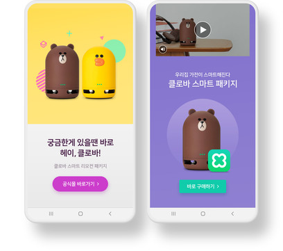

# 보상형 광고
보상형 광고는 사용자에게 인센티브를 제공하는 형태의 광고로써 Full screen 내에서 동영상 보기를 완료했을 때 보상을 제공하는 형태의 광고입니다.



----

### [Step 1] Dependency 추가 및 초기화
[공통 통합 내용을 참고해 주세요](../README.md)

----

### [Step 2] (샘플을 위한 옵션) 레이아웃 추가
(배너나 네이티브와는 다르게) 보상형 광고를 위해 ViewGroup을 만들 필요는 없습니다.\
다만 광고의 load 와 show 각 단계를 구별하기 위해 샘플에서는 show 버튼을 만들어 사용합니다.\
서비스에서는 광고 노출 시나리오에 맞춰 구현하시면 됩니다.

```
<androidx.constraintlayout.widget.ConstraintLayout xmlns:android="http://schemas.android.com/apk/res/android"
    xmlns:app="http://schemas.android.com/apk/res-auto"
    xmlns:tools="http://schemas.android.com/tools"
    android:layout_width="match_parent"
    android:layout_height="match_parent"
    tools:context=".MainActivity">

    <Button
        android:id="@+id/show_button"
        android:layout_width="wrap_content"
        android:layout_height="wrap_content"
        android:layout_marginTop="20dp"
        app:layout_constraintEnd_toEndOf="parent"
        app:layout_constraintStart_toStartOf="parent"
        app:layout_constraintTop_toTopOf="parent" />
        android:text="SHOW" />

</androidx.constraintlayout.widget.ConstraintLayout>
```

----

### [Step 3] 광고 파라미터 생성 및 로드
`GfpRewardedAdManager` 의 instance 를 생성후, `loadAd()` 메서드를 호출함으로써 보상형 광고를 `load`할 수 있습니다.

> 이때 `activity context`가 필요합니다.\
Unity 등 대부분의 DSP 에서 `activity context`를 넘겨주지 않는 경우 오동작합니다.

배너나 네이티브 광고에선 `load`가 광고 게재(`show`)와 연결 되지만, 보상형/전면형 광고에서는 `load`와 `show`가 분리되어 있습니다.\
`load` 는 광고를 보여주기 위한 준비를 하는 단계입니다.

----

### [Step 4] 광고 이벤트 수신
`GfpRewardedAdManager` instance 에 아래와 같이 `RewardedAdListener` 를 설정함으로써 다양한 광고 이벤트를 수신할 수 있습니다.

```
rewardedAdManager.setAdListener(new RewardedAdListener() {
    @Override
    public void onAdLoaded(GfpRewardedAd ad) {
        // 광고 로드 성공시
    }

    @Override
    public void onAdStarted(GfpRewardedAd ad) {
        // 광고가 정상적으로 보여지기 시작했을 때
    }

    @Override
    public void onAdClicked(GfpRewardedAd ad) {
        // 광고 클릭 됐을 때
    }

    @Override
    public void onAdClosed(GfpRewardedAd ad) {
        // 광고가 close 됐을 때
    }

    @Override
    public void onAdCompleted(GfpRewardedAd ad) {
        // 광고 정상적으로 완료됐을 때
    }

    @Override
    public void onError(GfpRewardedAd ad, GfpError error) {
        // 광고 로드 실패 또는 렌더링 도중에 에러 발생시
    }
});
```

----

### [Step 5] 광고 게재 (Show)
광고 이벤트 중 `onAdLoaded()` 가 호출됐을 때 광고를 게재할 수 있습니다.\
샘플에선 show button을 활성화 해서 게재 준비를 합니다.

광고를 show 하기 전에 optional 하게 `isAdInvalidated()` 를 호출함으로써 광고의 유효함을 체크할 수 있습니다.\
해당 메서드가 true 를 return 할 경우, 해당 광고는 유효하지 않은 상태이므로 광고 제공자에 따라서 광고는 보여지지만\
정상적으로 과금이 발생하지 않는 상황이 발생 할 수 있습니다.

참고로 DSP 마다 광고의 유효 시간이 있을 수 있는데, DSP 마다 다르지만 로드 이후 시간이 오래 지나면 invalid 한 상태가 될 수 있습니다.

또한 한번 `show` 된 광고는 다시 `show` 가 되지 않습니다.

> `showAd()` 메서드에 argument 로는 `ActivityContext` 가 전달되어야만 합니다.

```
public class MainActivity extends Activity {
  private GfpRewardedAdManager rewardedAdManager;
  private Button showButton;

  @Override
  protected void onCreate(Bundle savedInstanceState) {
    super.onCreate(savedInstanceState);
    setContentView(R.layout.activity_main);
    showButton = findViewById(R.id.show_button);
    showButton.setEnabled(false);

    showButton.setOnClickListener(new View.OnClickListener() {
                @Override
                public void onClick(View v) {
                    // 유효성 체크
                    if (rewardedAdManager.isAdInvalidated()) {
                        Log.d("MainActivity", "광고가 유효하지 않습니다");
                        return;
                    }

                    rewardedAdManager.showAd(requireActivity());
                }
            });

    AdParam adParam = new AdParam.Builder()
                .setAdUnitId("YOUR_AD_UNIT_ID")
                .addUserParam("testKey", "testValue")
                .build();

    rewardedAdManager = new GfpRewardedAdManager(this, adParam);

    // 필요시 타임아웃 셋팅
    // rewardedAdManager.setTimeoutMillis(60_000L);

    rewardedAdManager.setAdListener(new RewardedAdListener() {
        @Override
        public void onAdLoaded(GfpRewardedAd ad) {
            Log.d("MainActivity", String.format("로드 완료. responseInfo[%s]",ad.getResponseInfo().toString()));
            showButton.setEnabled(true);
        }

        @Override
        public void onAdStarted(GfpRewardedAd ad) {
            Log.d("MainActivity", "시작");
        }

        @Override
        public void onAdClicked(GfpRewardedAd ad) {
            Log.d("MainActivity", "클릭 발");
        }

        @Override
        public void onAdClosed(GfpRewardedAd ad) {
            Log.d("MainActivity", "광고 종료");
            showButton.setEnabled(false);
        }

        @Override
        public void onAdCompleted(GfpRewardedAd ad) {
            Log.d("MainActivity", String.format("완료 - 리워드 발생할 수 있음. responseInfo[%s]",ad.getResponseInfo().toString()));
        }

        @Override
        public void onError(GfpRewardedAd ad, GfpError error) {
            String errorString = String.format("code[%d] subCode[%s] message[%s] responseInfo[%s]",
                    error.getErrorCode(),
                    error.getErrorSubCode(),
                    error.getErrorMessage(),
                    ad.getResponseInfo().toString()
            );
            Log.e("MainActivity", errorString);
        }
    });

    rewardedAdManager.loadAd();
  }

  @Override
  public void onDestroy() {
      if (rewardedAdManager != null) {
          rewardedAdManager.destroy();
      }

      super.onDestroy();
  }
}
```

----

### [Step 6] 광고 삭제
배너 광고의 게재가 끝나면 광고가 올바르게 폐기되도록 광고를 삭제해야 합니다.\
광고 삭제는 아래와 같이 `GfpRewardedAdManager` 가 제공하는 `destroy()` 를 호출하면 됩니다.

```
rewardedAdManager.destroy();
```
